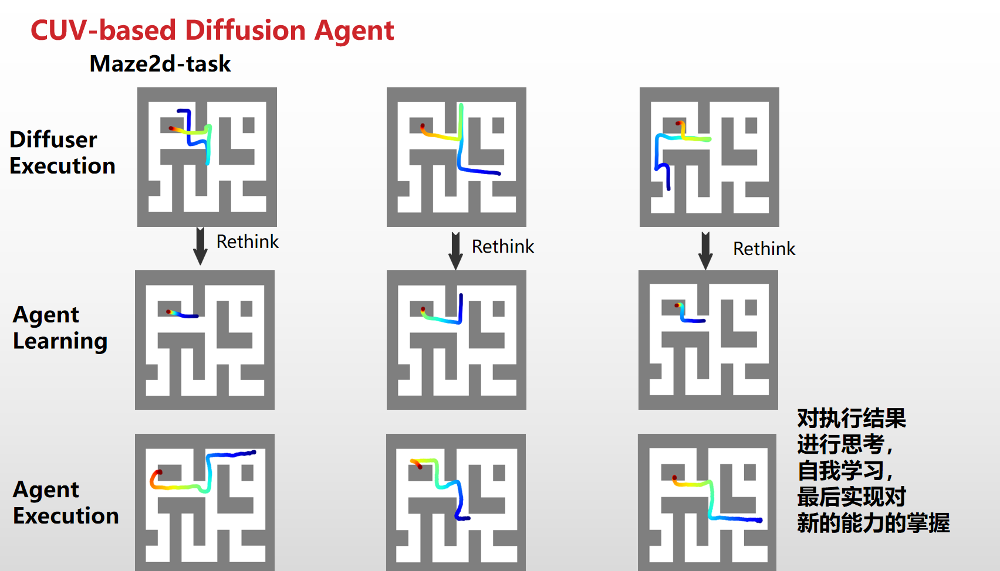
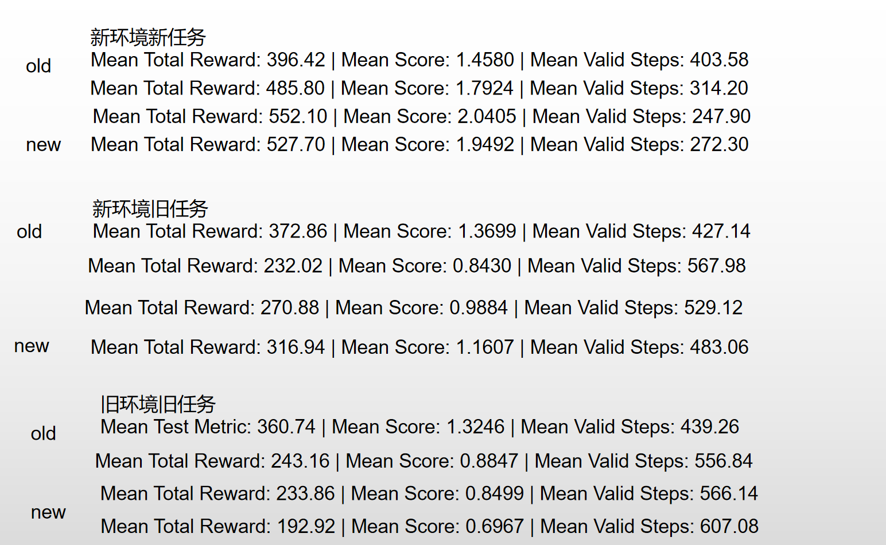
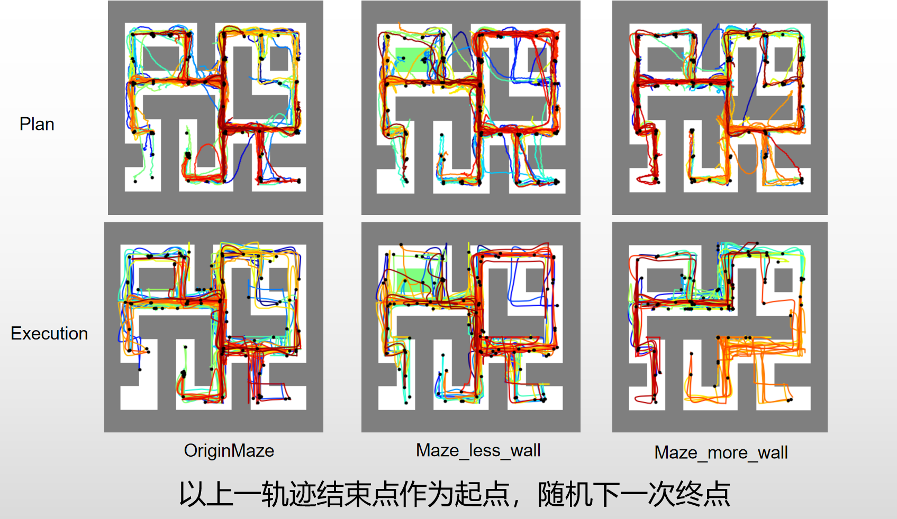
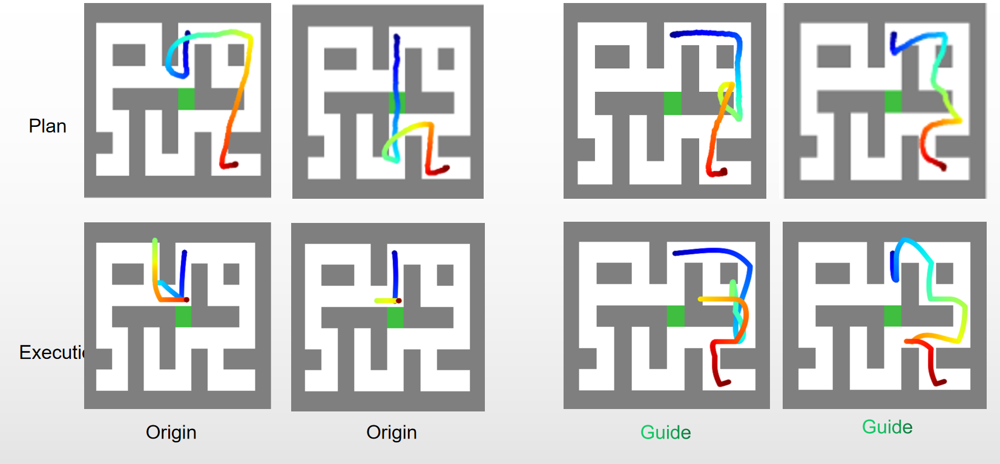
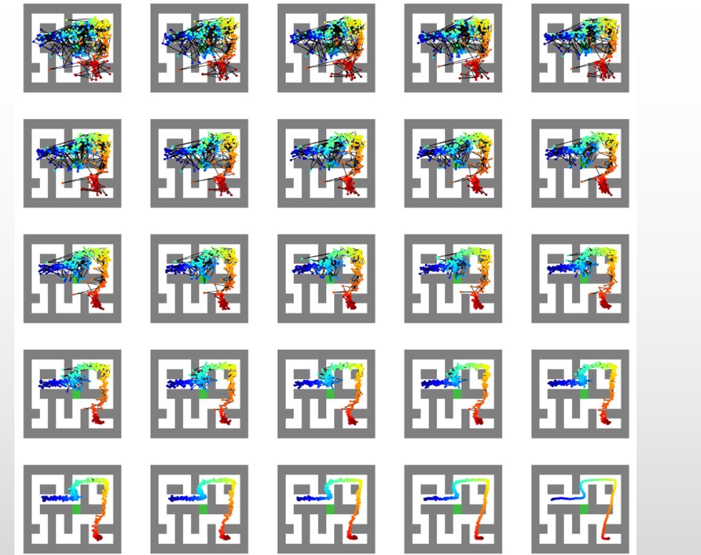
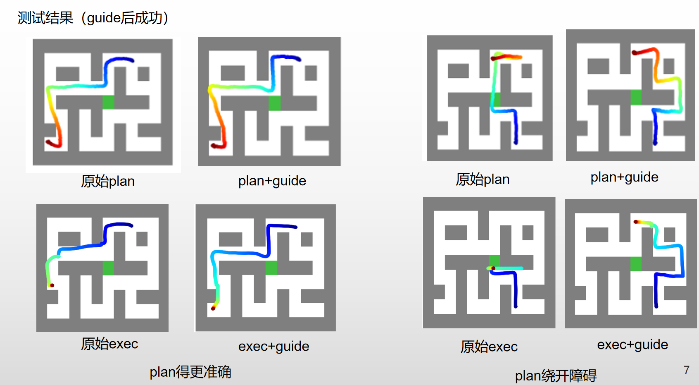

# Planning with Diffusion by CUV agent

## Quickstart

This repository is forked from [Planning with Diffusion for Flexible Behavior Synthesis](https://diffusion-planning.github.io/).

## RoadMap
### 4.08~4.26
1. learning $CUV$ system: $C$ (Cognitive); $U$ (Utility); $V$ (Value).
2. learning classic planning methods: 
    1. Dreamers (model-based)
    2. Option (hierarchy RL)
    3. Diffuser (Diffusion based off-line)

### 4.27~5.22
1. Diffusion
    1. classifier guided
    2. classifier free
2. CUV+diffusion what why?
    1. P(U|$\tau$)
    2. strong plan ability
    3. evolve ability 
  
### 5.23~6.4
1. check the code of diffuser and maze2d env
2. diffuser environment setting up
3. find shortcomming of diffuser:
    1. state only includes posi, no idea about env. Only can memorize the off-line data whereas the true env plan ability.
    2. no value guide for maze2d.

$$
\begin{split}
    g &= \nabla_{\tau^t=\mu^t} \log p_\phi(O_{1:T}, U|\tau^t) \\
      &= \nabla_{\tau^t=\mu^t} \log \left[ p_{\phi_1}(O_{1:T}|\tau^t) p_{\phi_2}(U|\tau^t) \right] \\
      &= \sum_{t=0}^T \nabla_{s_t} r_{\phi_1}(s_t) + Z_0 \sum_{t=0}^T \nabla_{s_t, s_{t+1}} \log \max_{a_t \in U_t} p_{\phi_2}(s_{t+1}|s_t, a_t) p(a_t) \\
      &= \nabla J(\mu) \\
    p(\tau^{t-1}|\tau^t, O_{1:T}, U) &= Z p_\theta(\tau^{t-1}|\tau^t) p_\phi(O_{1:T}, U|\tau^{t-1}) \\
      &= \mathcal{N}(\mu^t + w \Sigma^t g, \Sigma^t)
\end{split}
$$

### 6.5~6.23
**Attempt 1**
1. assign the target in the wall, aka, new ability
2. crop some valid path into a buffer
3. finetune the pretrained diffuser to use the new ability better.
```python
python generate_data.py # generate rollout data for different start and target point
python train.py --config maze2d_finetune# load pretrained and fine tune
```

<p align="center">
    
</p>
 
4. results: although better in new task but worse in old tasks
<p align="center">
    
</p>

### 6.24~6.26
**Attempt 2**
1. too simple, can not be recognized as a method.
2. also only memorize.
3. explore the whole maze.
```python
python coverage.py --config maze2d_cover.py #connect different traj
#using Maze2dRendererCover
```
<p align="center">
    
</p>
4. the agent can explore the whole map. How to use it?

### 6.27~7.13
**Attempt 3**
1. Env-guided diffuser
2. read papers:
    1. conditional diffuser (compose classifier)
    2. meta diffuser (latent code of task)
    3. safe diffusion (constraints)
3. also data based. proposed a true env-based diffuser
4. guide away from wall\
```python
python plan_guided.py --config maze2d_guide.py
# use the guides.guides and guided_policies
```
<p align="center">
    
</p>
<p align="center">
    
</p>
5. rule-based, not general, can not forbid hithting the wall

### 7.14~8.3
1. learnable guide
2. read paper
    1. Qss
    2. andrew tutorial
3. cost guide (c = |x'-x''|), the diff of plan and exec. Idealy, if plan in the wall ,it can not arrive, c must be big, after learning, it can plan forbid the wall.
```python
python train_cost_robust --config maze2d_cost_robust.py
#training 1.collecting with pretrained 2.train cost 3. test  using CostRobustTrainer
```

<p align="center">
    
</p>
4. guide is more like a sort of existing distribution, not a new road.


### 8.4~current
1. MCTD(plan + exploit)
2. over


